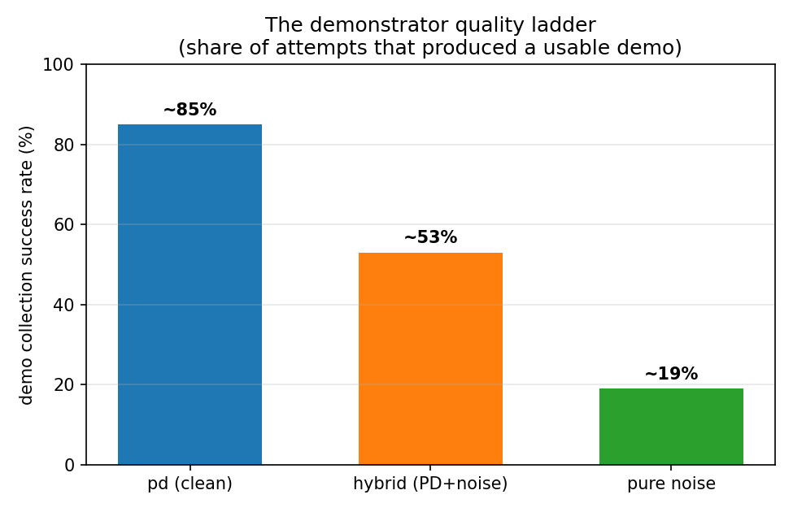
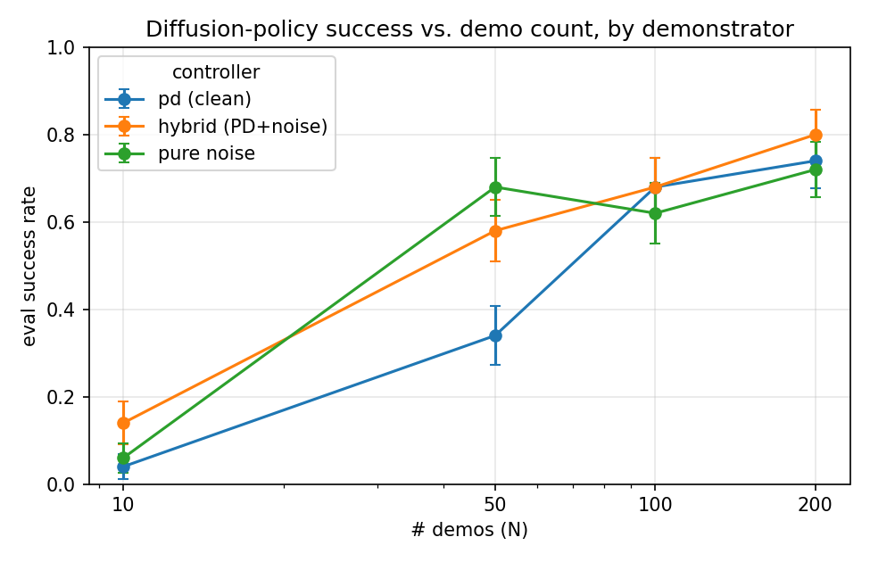
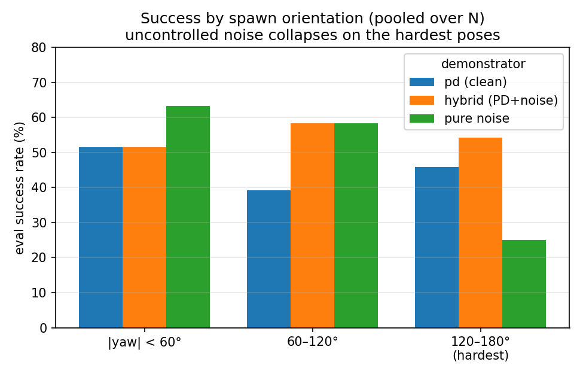

# An Analysis of Diffusion Policy under Varying Demonstration Quality and Quantity

This project trains a diffusion policy to perform square-nut peg insertion. The twist is where
the demonstrations come from. Instead of a human teleoperator, they come from three classical
controllers built to different quality levels on purpose. By sweeping demonstration quality
against demonstration quantity, the project asks a practical imitation-learning question: when is
more cheap, noisy data worth more than fewer clean demonstrations, and where does noisy data stop
paying off?

The short answer is that a learned policy is shaped far less by the raw precision of its
demonstrations than by how much of the task's state space those demonstrations happen to cover. A
noisy demonstrator that wanders through more states can beat a flawless one that always traces the
same narrow path.

---

## Motivation & Background

**Diffusion Policy.** A diffusion policy starts from Gaussian noise and iteratively denoises it
into an action sequence, conditioned on the current observation. Rather than classifying the next
action, it learns the gradient of the action distribution and represents that distribution
implicitly. This is a different approach from tokenized or autoregressive methods, which
discretize actions into tokens and predict them one step at a time.

**Why peg insertion, and why classical controllers.** Contact-rich tasks like peg insertion have
a long history of being solved classically, with closed-loop control and force feedback. That
history is useful here: it means we can generate demonstrations at any quality level we like, on
demand, and know exactly how each one was produced. That control over the data is what makes the
task a clean testbed for the real question:

> If the same task is demonstrated by controllers of different quality, say a precise expert, a
> competent but shaky operator, and a near-random flailer, how does the learned policy differ, and
> how much does demonstration quantity make up for demonstration quality?

**The tension in imitation learning.** Behavior cloning only learns the states it actually sees. A
flawless expert traces a narrow tube through state space, so a policy that drifts even slightly
falls off-distribution and has no learned response. This is the classic covariate-shift failure of
BC. Injecting noise into the demonstrations widens that tube, because the policy now sees, and
learns to recover from, states off to the side of the nominal path. The whole project is an
attempt to measure that trade-off directly.

---

## Implementation

The pipeline comes together in three stages: a custom simulation environment, three classical
controllers that generate the demonstrations, and the training plus evaluation of 12 diffusion
policies on GPU.

### Step 1: The Environment

The task is square-nut peg insertion, built as a subclass of robosuite's `NutAssemblySquare`
(robosuite 1.5.2, MuJoCo 3.8.1) with a Panda arm. The subclass, `Manipulation_Enviroment`, adds
insertion-aware staged rewards on top of the parent's four stages, which gives a smooth six-rung
reward staircase:

```
reach → grasp → lift → hover → insert → seat
 0.10    0.35    0.50   0.70     0.80    0.90
```

The first four rungs are inherited unchanged. The two new ones, `insert` and `seat`, fold
continuous geometric quantities (lateral XY error, descent onto the peg) through `tanh` gains
chosen from the task geometry. Each gain is anchored so it pays half credit at a physically
meaningful offset, for example the 6.75 mm mechanical clearance or `on_peg`'s 30 mm tolerance,
rather than being a hand-picked constant. This keeps the reward monotone all the way down the
final descent, which the parent's peg-midpoint distance term does not do.

A couple of facts about the task drove the design:

- **Orientation is the dominant variation.** At reset the nut's XY position varies by only about
  5 mm in x and 11 cm in y, but its yaw is uniform over the full 360°. Yaw is what both the grasp
  phase and the trained policy have to generalize over.
- **Success requires releasing the nut.** robosuite's `_check_success` fires while the gripper is
  still holding the seated nut, but letting go is the real end of the task. So demos are recorded
  through release and retreat, not cut off at first success.

The environment is validated by `test_env.py`, which passes 17 of 17 checks covering reward
monotonicity, stage caps over 2000 random poses, and `reward()` landing at exactly 1.0 on success.

### Step 2: The Controllers

Three controllers form a deliberate quality ladder. Each one differs from the next in exactly one
respect, which is what keeps the ablation interpretable. All three share a single phase-indexed
state machine (approach, descend, grasp, lift, transport, insert, release, retreat) and differ
only in what corrupts the action:

| Controller | What it is | Role |
|---|---|---|
| **`pd`** (clean PD) | precise position and yaw servo, with lateral-force correction during insertion | a repeatable expert |
| **`hybrid`** (PD + noise) | the same PD loop, but Gaussian noise added to each output action, so the loop still senses and corrects | a competent operator with a shaky hand |
| **`pure_noise`** | a naive heuristic dominated by large Gaussian noise, no force feedback, no fine servo | worst case, succeeds mostly by luck |

> **Naming note.** The eval JSONs and analysis use the names above. Some on-disk artifact paths
> (`data/*.hdf5`, checkpoint dirs) keep older filenames. Those are just paths, not claims about
> what the arm is doing.

Getting the clean PD controller to work was where most of the physics lived, and the decisive wins
turned out to be geometric rather than force-related. The nut hangs 5.4 cm from its grasp point
and droops as much as 16.5° on contact, wedging across the peg instead of sliding down it. A stiff
XY servo actually makes the jamming worse, twisting a touched-down nut tighter. Cross-axis coupling
during the descent drags the grasp off the handle. Correcting the nut tilt, softening the
insert-phase XY gain, switching to a constant-rate descent, and relaxing one transport tolerance
from 3.5 mm to 5.5 mm took the clean controller from roughly one-in-three to about 85% collection
success.

Each controller is run to collect only successful demonstrations, at four dataset sizes
N ∈ {10, 50, 100, 200}, for 3 × 4 = 12 datasets in total. The three controllers are run against a
shared per-episode seed list, so at any given N they face the same initial states. The
per-controller collection yield, meaning the share of attempts that produced a usable demo, is
itself a headline result and sets up the ablation:



The HDF5 layout (`obs`, `actions`, `rewards`, `dones`, `states` per demo) is written directly in
the robomimic-style format that diffusion_policy's low-dim loader expects, so training needs no
conversion. The pinned observation set is 16-dimensional: `robot0_eef_pos` (3),
`robot0_eef_quat` (4), `robot0_gripper_qpos` (2), `SquareNut_pos` (3), `SquareNut_quat` (4).
Actions are 7-dimensional OSC deltas.

### Step 3: Training & Evaluation on GCP

Each of the 12 datasets trains one low-dim diffusion policy (UNet, `diffusion_policy_lowdim`
config), all with identical hyperparameters and epoch counts so the ablation stays fair. The only
thing that changes across runs is the dataset itself.

Training and evaluation both run on a GCP L4 GPU rather than the M2 Mac. The reason is the
diffusion sampler: a 100-step DDPM chain costs about 3.7 s per prediction on MPS, which makes the
sampler roughly 96% of eval wall-time. The full 12 × 50-rollout sweep takes around two days
locally versus a few hours on the L4. The runbook in `gcp/README.md` provisions the VM, transfers
code and data, trains all 12 in `tmux`, and then evaluates in place. Evaluation needs no
headless-GL setup because rollouts run pure MuJoCo physics, with
`has_offscreen_renderer` and `use_camera_obs` both off.

Evaluation is deliberately harder than collection, in two ways that matter when reading the
numbers:

- **It is unfiltered.** Each policy is scored over 50 rollouts from `env.reset()` with uniform yaw
  over ±180°, whereas the training set kept only successful demos and is therefore yaw-biased
  toward easy poses. Eval success sits below collection success by construction.
- **It is paired.** Placement is reseeded per rollout from a fixed base, so all 12 policies are
  scored on the same 50 initial states.

At 50 rollouts the binomial standard error is about 6 to 7% near 50% success. That is the ruler for
deciding whether a gap between cells is real.

---

## Analysis: the training distribution shapes the policy

The central result is a 3 (demonstrator) by 4 (N) grid of eval success rates:

```
controller        | N=10   | N=50   | N=100  | N=200
pd (clean)        |   4%   |  34%   |  68%   |  74%
hybrid (PD+noise) |  14%   |  58%   |  68%   |  80%   <- best cell
pure noise        |   6%   |  68%   |  62%   |  72%
```
*(± ~3 to 7% SE per cell.)*



The organizing idea is training-distribution coverage. A behavior-cloning policy only learns the
states it saw, so it helps to read each demonstrator through that lens.

- **`pd` (clean, narrow distribution).** This one is data-hungry. It is nearly useless at N=10 to
  50 (4%, then 34%), because the narrow demo tube gives poor coverage and small N compounds the
  problem. Clean PD only becomes competitive once N is large enough to densely cover that narrow
  tube (68%, then 74%). This is covariate shift made visible: a precise expert that never strays
  teaches the policy nothing about how to recover once it does.

- **`hybrid` (PD + noise, widened but still controlled).** This is the thesis case. Noise broadens
  coverage without destroying demo quality, because the underlying PD loop still senses and
  corrects, so the extra states it visits are recoverable ones. Coverage that stays useful keeps
  paying off as data grows, which is why `hybrid` leads at scale (80% at N=200) and never trails
  clean PD.

- **`pure_noise` (widest distribution, but uncontrolled).** Same coverage mechanism, taken too far.
  It is the best cell at N=50 (68%), since maximal coverage helps most when data is scarce, but
  then it plateaus (62 to 72%) instead of climbing. The demonstrations themselves lack controlled
  movement, so coverage gets you started but demo quality caps the ceiling. Adding more data cannot
  teach precision that was never demonstrated in the first place.

The yaw breakdown is what settles the last point. Pooling all rollouts by spawn orientation,
`pure_noise` collapses to 25% on the hardest poses (|yaw| 120 to 180°) while `hybrid` holds at 54%.
Those are exactly the poses where real control authority, not luck, is required:



### What the data supports, and how firmly

- **Firm finding: a wider distribution buys better sample efficiency.** At N=50, both noisy
  demonstrators (58% and 68%) beat clean PD (34%) by margins well outside the error bars. When data
  is scarce, coverage dominates precision.
- **Suggestive but not decisive: a wider distribution buys a higher ceiling.** At N=200 the three
  arms sit at 72, 74, and 80% with about 6% SE each, so `hybrid`'s lead is within roughly one SE.
  Sharpening this would take more rollouts per cell, since SE shrinks like 1/√n, plus a paired
  per-seed test that exploits the shared seed list rather than comparing marginal rates.

### Takeaway

Noise helps a learned policy by widening the training distribution. Controlled noise (`hybrid`)
widens it with recoverable states and wins on sample efficiency, and tentatively at scale too.
Uncontrolled noise (`pure_noise`) widens it with junk, which is great for a cold start but hits a
quality ceiling and fails where precision matters. For real-world data collection the implication
is concrete. A cheaper, shakier demonstrator can be better than a pristine one, as long as its
imperfections still trace recoverable states. But there is a floor on quality below which more data
stops buying you anything.

---

## Repository layout

```
peg_insertion/
  envs/Manipulation_Enviroment.py      custom env: 6 staged rewards
  controllers/                         pd / hybrid / pure_noise, shared FSM
  data_collection/collect_demos.py     env + controller -> HDF5 (12 datasets)
  training/eval.py                     receding-horizon rollout -> success JSON
  analysis/analyze_ablation.py         12 JSONs -> table + curve + yaw breakdown
data/                                  12 HDF5 demo datasets (3 controllers x 4 N)
eval_results/                          12 eval JSONs (success_rate, per_rollout)
gcp/                                   train + eval runbook and scripts for the L4 VM
docs/analyzing_results.md              full walkthrough of the ablation result
```

**Reproduce the analysis** (from `proj/`, in the `diffpol` env):

```bash
python peg_insertion/analysis/analyze_ablation.py   # table + yaw breakdown + ablation.png
```
